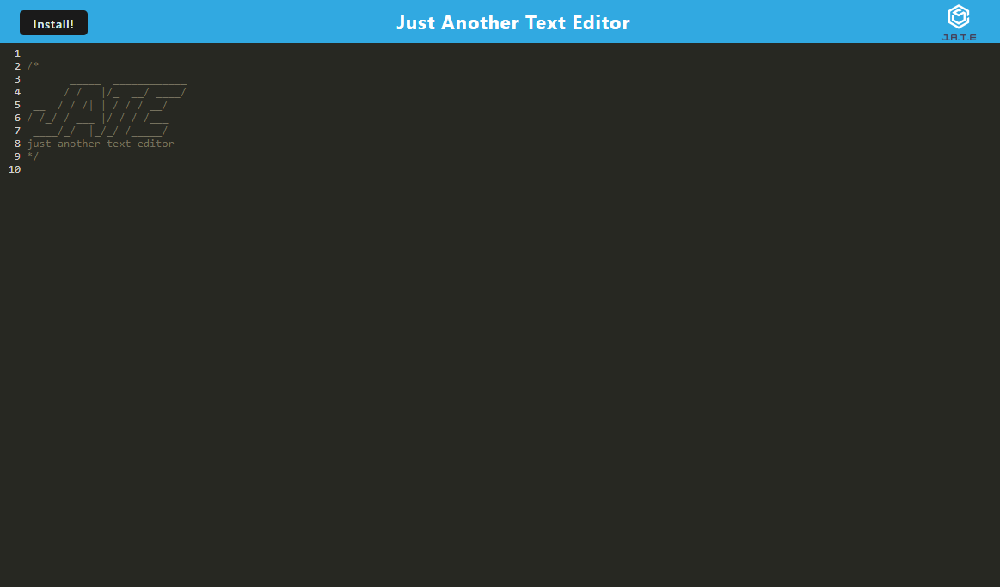

# Text Editor

## Description  
The application is meant to be a digital notepad for those that need to save a thought at any point in the day. Notes will never be deleted or cleared unless the user chooses to remove all characters. What is written on the page will be automatically saved and will be rendered when the application is refreshed. The application can also work offline once installed.

*Starter Code provided by Southern Methodist University Full Stack Web Development Bootcamp

## Table of Contents  
[Description](#description)   
[Installation](#installation)  
[Usage](#usage)  
[License](#license)   
[Tests](#tests)  
[Questions](#questions)  

## Installation  
The editor should open on its own once the site link is accessed (link to deployed app below). The site can also be installed on the user's device on the top left of the window or in the browser.

## Usage  

[Link to Deployed App](https://powerful-hamlet-49828.herokuapp.com/)

## License 
MPL 2.0
[Link to License](https://www.mozilla.org/en-US/MPL/2.0/)

## Tests  
To test that this editor is working add or delete to the exisitng notepad and try to refresh the page. The editor should continue to render whatever is on the page, including the changes made to the page. Users should also try to install the application on their devices and test that the functionality of the app is still the same once downloaded.

## Questions
Link to github: [Click Here](https://github.com/colinmchale)  
Please submit any additional questions you may have in an email to colin.mchale22@gmail.com
